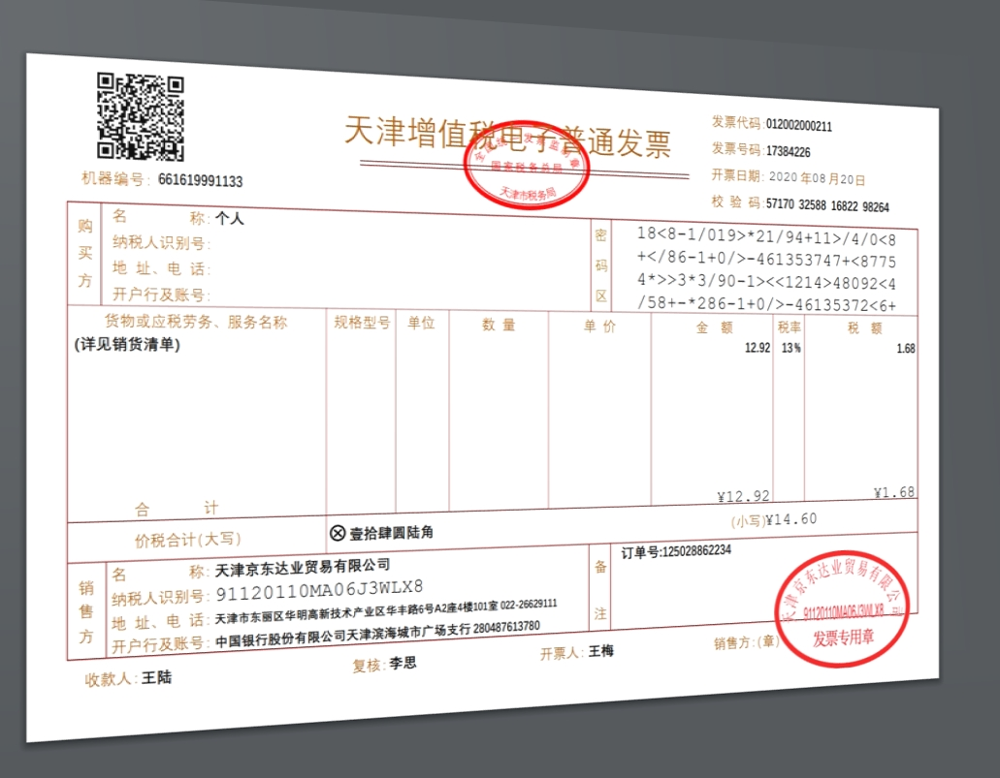

# 票据自动化处理 -Version1.0-

这个小项目是我暑假时临时起意的一个作品，起因是发现日常生活中，我们经常遇到需要将票据中的信息手工输入电脑，制作成电子版的excel文件的情况。而这种手工输入十分的费时费力，而且很容易出错，所以本项目希望使用python结合文字识别技术（ocr），自动化处理上述过程。

本项目作为票据自动化处理的第一版，为简化问题，对于需要识别的目标，采用提前确定位置的方式，简化了文字定位的工作，具体分为以下几个步骤：1.原始图片视角变换及裁剪；2.根据已知位置识别相应文字；3.将识别到的信息保存到相应excel文件中。

## 1.原始图片视角变换及裁剪：

现实中，我们拍照不可能像扫描那样端正，图片中的票据总会有这样那样的视角上的歪斜，使用这样的图片直接来识别极易出错，为了提高识别的准确性，我们需要先将图片预处理为扫描样式的正视图，并将不属于票据的图片部分剪切掉。

针对这一过程，参考相关资料本项目采用“整体图片边缘检测”（采用cv2.Canny函数）、“票据轮廓检测”（采用cv2.findContours函数），得到所需处理票据的轮廓，之后确定票据的四个顶点，最后使用cv2.getPerspectiveTransform和cv2.warpPerspective对于原始图片进行透视变换得到相应的票据的正视图。

## 2.根据已知位置识别相应文字：

作为第一个版本，简单起见，这里采用了提前找到感兴趣的如发票代码、销售方名称、备注等条目的位置，直接在上述正视图图片中截取对应的区域的方式找到相应信息的图片（见下图），通过cnocr库对于得到的区域图片进行文字识别。

识别的结果如下图所示，可以发现除“销售方地址电话”条目由于文字较小及中文数字混排导致识别有问题，其他部分的识别均十分准确，作为初步的方案，基本可以满足需求。

## 3.将识别到的信息保存到相应excel文件中：

这里，我们采用pandas库将识别到的信息按年月的不同分别存储到以“xxxx年-xx月.xlsx”命名的文件中。

## 总结：

通过上述过程，实现了简单的固定位置信息的票据自动化处理，基本能够满足一些简单的需求，但是面对一些较小的文字以及混排文字的时候，在文字识别上存在一定的误差；且这种方式仅能对特定格式的票据进行处理，一旦票据格式不同，需要重新确定所需信息在图片中的位置信息。

针对上述问题的改进。。。。。。有时间再说吧:p